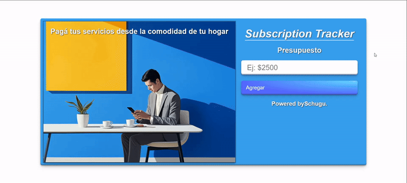
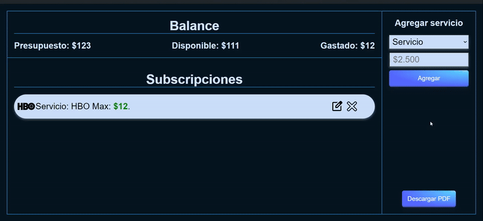

<h1 align='center'>🌟 Página Subscriptions Tracker  📋🌟</h1>

> Practica de HTML, CSS, JavaScript y React. ✨

🎯 Objetivo: Crear una página para trackear subscripciones.

Esta idea de proyecto está inspirada en el video "[Subscriptions Tracker - Suscripciones App - Streaming - React Js - JavaScript - ECMA6](https://www.youtube.com/@blackcode2)"
Aunque me guié por la idea presentada en el video, he desarrollado esta página a mi manera, añadiendo mis propios enfoques y personalizaciones. Puedes encontrar el video en este enlace [aquí](https://youtu.be/ermKvCAtiKA?si=U8vqK_Svsx4hMTu3 "Click aquí").

------------

### Instalación y ejecución 🛠️💻

Sigue estos pasos para clonar y ejecutar el proyecto localmente:

1. Abre la consola en la ubicación deseada para clonar el repositorio.

2. Para clonar este repositorio en tu máquina local utilizando Git, ejecuta el siguiente comando:

    ```bash
    git clone https://github.com/Schugu/ToDoList.git
    ```

3. Navega al directorio del proyecto clonado:

    ```bash
    cd ToDoList
    ```

4. Instala las dependencias del proyecto utilizando npm o yarn:

    ```bash
    npm install
    # o
    yarn
    ```

5. Inicia el servidor de desarrollo utilizando Vite:

    ```bash
    npm run dev
    # o
    yarn dev
    ```

6. Una vez que el servidor de desarrollo esté en funcionamiento, abre tu navegador web y navega a la IP que se muestra en la consola para ver el proyecto en acción.

### Personalización y comprensión del proyecto 🎨🧠

7. Si deseas personalizar los estilos de la página, puedes hacerlo modificando los archivos CSS ubicados en la carpeta `src`, así como los archivos CSS de los componentes en la carpeta `src/components`. Abre el archivo CSS correspondiente en tu editor de texto o IDE preferido, realiza los cambios que desees y guarda el archivo. Luego, asegúrate de que los estilos se apliquen correctamente importando el archivo CSS adecuado en el archivo JSX correspondiente.

8. Además, si deseas modificar o entender cómo funciona un componente específico, te recomiendo revisar los archivos JSX correspondientes ubicados en la carpeta `src`, así como los archivos JSX de los componentes en la carpeta `src/components`. La lógica de la aplicación se encuentra principalmente en los archivos `App.jsx` dentro de `src`, mientras que los componentes individuales se encuentran en la carpeta `src/components`. Puedes analizar el código en estos archivos JSX para entender su funcionamiento o realizar modificaciones según sea necesario.


------------

### Capturas de pantalla 📸




